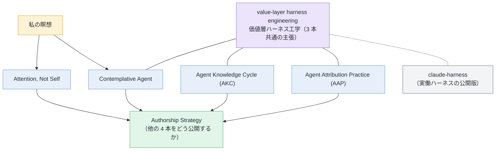

Language: [English](README.md) | 日本語

# shimo4228

> shimo4228 が続けている 5 本の長期プロジェクト（それぞれ単独で引用できます）をまとめた hub リポジトリです。中身は、私が AI エージェントをどう作っているか、読者がまず LLM に尋ねる時代に著者がどう見つかり続けるか、そして自分の瞑想から心の働きについて何が見えたか、です。エージェント設計の 3 本はひとつの主張を共有しています（その中身は [Through-line](#through-line) 節へ）。

こんにちは、shimo4228 です。ラボにも組織にも属さず、AI エージェントを一人で作りながら「AI 時代の良いやり方」を実地で探っています。そのひとつ Contemplative Agent は、クラウドの API ではなく M1 Mac 上のローカル LLM で動いています。私は瞑想もしていて、5 本のうち 1 本はそこで見えたことをそのまま書き留めたものです。DOI は肩書きのためではなく、探究を引用できる形で残しておくための道具です。

エージェントのハーネス（エージェントに渡す規則とツール一式）を作っている人、自律エージェントの説明責任を考えている人、AI 時代の著者性に関心がある人に向けています。5 本とは別に、私が毎日使っているハーネスそのものも [claude-harness](https://github.com/shimo4228/claude-harness) として公開しています。このリポジトリ自体は全体の地図で、各プロジェクトの最新情報はそれぞれのリポジトリにあります。ここに置くのは、プロジェクト同士の変わらない関係と引用先、そして執筆物・データ・機械読解への入口です。

## 早見表

| プロジェクト | 役割 | 核になる考え | 代表的な引用先 |
|---|---|---|---|
| [Contemplative Agent](https://github.com/shimo4228/contemplative-agent) | エージェントの気質設計と実装 | 自分の価値観の層を Constitution（憲法）という明示的なファイルとして持ち、経験にもとづく改訂のたびに人間のレビューを通すローカルエージェント。 | [DOI 10.5281/zenodo.19212118](https://doi.org/10.5281/zenodo.19212118) |
| [Agent Knowledge Cycle (AKC)](https://github.com/shimo4228/agent-knowledge-cycle) | エージェント設計の仕組み | エージェントと操作者の意図のずれを、振る舞いと判断が変わっていく中でも直し続けるための 6 フェーズのループ。 | [DOI 10.5281/zenodo.19200726](https://doi.org/10.5281/zenodo.19200726) |
| [Agent Attribution Practice (AAP)](https://github.com/shimo4228/agent-attribution-practice) | 説明責任の実践 | 「何を禁止するか、制御をどこに置くか、エージェントが壊れたとき誰が責任を持つか」を、特定ツールに依存しない形で記録した設計判断（ADR）集。 | [DOI 10.5281/zenodo.19652013](https://doi.org/10.5281/zenodo.19652013) |
| [Authorship Strategy](https://github.com/shimo4228/authorship-strategy) | AI 時代の著者性 | 読者が LLM 越しに考えに出会う時代には、考えだけが広まって著者の名前が落ちることが起きます。そこで取る方針を記録した枠組み: 囲い込むのではなく開くことで、広まること自体に出どころを運ばせる。 | [DOI 10.5281/zenodo.20263316](https://doi.org/10.5281/zenodo.20263316) |
| [Attention, Not Self](https://github.com/shimo4228/attention-not-self) | 瞑想から出てきたエッセイ | 個人のエッセイ集と知識グラフ。瞑想で気づいたことを、古典仏教の心の地図（アビダルマ）で言い表し、現代の体験の計算モデル（計算論的現象学）と並べてみたもの。 | [DOI 10.5281/zenodo.20262112](https://doi.org/10.5281/zenodo.20262112) |

5 本は兄弟プロジェクトで、互いに依存していません。どれかを先に読んだり使ったりする必要はなく、どれか 1 本だけでも単独で使えます。関心に近いところから開いてください。表の DOI は Zenodo の concept DOI（常に最新版へつながる代表 DOI）です。

## Through-line

エージェント設計の 3 本（Contemplative Agent / AKC / AAP）を貫く主張が **[value-layer harness engineering（価値層ハーネス工学）](https://shimo4228.github.io/shimo4228/concepts/value-layer-harness-engineering.html)** です。

ハーネスに普通書かれるのは、コーディング規約のような作業上の規則です。この 3 本では、同じ場所に価値の規範も書き込みます。具体的には、瞑想から生まれた行動指針（contemplative axioms）と、著者性をめぐる判断基準です。価値規範は一度書いて固定するものではなく、コードや他の規則と同じように、人間のレビューを通して改訂され続けます。

3 本はこの主張に別々の場所で出会います。Contemplative Agent は「そんな層を持ったエージェントが本当に動くのか」を、AKC は「双方が変わり続ける中でその層を操作者の意図に沿わせ続けられるか」を、AAP は「壊れたとき誰が責任を持つのか」を問います。

この主張は文書の上だけのものではなく、実際に動いています。[**claude-harness**](https://github.com/shimo4228/claude-harness) は、このページの全プロジェクトを支えている実働ハーネスの公開版です。価値規範を含む skills / agents / rules（ハーネスの構成部品）一式の中で私のエージェントたちが日々動き、その一式は各プロジェクトの述べるのと同じ人間レビューのサイクルで改訂され続けています。価値層ハーネス工学を書かれた主張としてではなく、生きた実例として見たいなら、ここから開いてください。

図の要約: 私自身の瞑想が Contemplative Agent と Attention, Not Self の源流にあります。エージェント設計の 3 本は価値層ハーネス工学という主張を共有し、その主張の実働形が claude-harness として公開されています。Authorship Strategy が、他の 4 本と自分自身を外に開いて引用できるようにしています。矢印は考えの流れを示すもので、依存関係ではありません。

## データと執筆

長文記事は [Zenn](https://zenn.dev/shimo4228) · [Dev.to](https://dev.to/shimo4228) · [Substack](https://substack.com/@shimo4228) に書いています（原稿は [zenn-content](https://github.com/shimo4228/zenn-content)）。このリポジトリの GitHub Traffic は公開 [dashboard](https://shimo4228.github.io/shimo4228/traffic/dashboard/) と [生データ](traffic/) で見られます（どちらも CC0）。ソース一式は [Software Heritage](https://archive.softwareheritage.org/browse/origin/?origin_url=https://github.com/shimo4228/shimo4228) にもアーカイブされています。

## 機械読解

AI やクローラ向けの読み順は [`graph.jsonld`](graph.jsonld) → [`llms.txt`](llms.txt) → [`llms-full.txt`](llms-full.txt) です。関連リポジトリ・データセットなどの全体目録も、これらのファイルと [concept index](https://shimo4228.github.io/shimo4228/concepts/)（用語ごとの解説ページ一覧）側にあります（この README は入口だけを担当します）。このリポジトリについて対話形式で質問したい場合は [DeepWiki](https://deepwiki.com/shimo4228/shimo4228) が使えます。

## 引用と識別子

著者: shimo4228 · [ORCID 0009-0002-6168-4162](https://orcid.org/0009-0002-6168-4162) · [Hugging Face @Shimo4228](https://huggingface.co/Shimo4228)

この hub は CC0 ライセンスです。各プロジェクトの内容を引用するときは、そのプロジェクトの concept DOI を使ってください。hub 自体を引用するのは、ここにある目録・ナレッジグラフ・traffic データ・probe データセット（LLM の応答を定点観測した時系列データ）を参照する場合だけです。機械可読の引用情報は [`CITATION.cff`](CITATION.cff) にあります。
