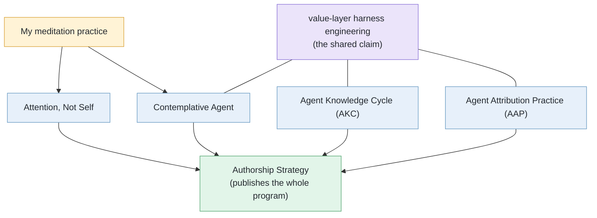

Language: English | [日本語](README.ja.md)

# Tatsuya Shimomoto (@shimo4228)

 

> Hub repository for five practice lines (long-running, independently citable projects) by Tatsuya Shimomoto: AI agent design, AI-mediated authorship, and computational phenomenology. The three agent-design lines share one claim (see [Through-line](#through-line)).

I'm Tatsuya Shimomoto. I build AI agents solo, with no lab and no affiliation, working out what good practice looks like in the AI age. One of them, Contemplative Agent, runs locally on an M1 Mac using a local LLM, not a cloud API. The papers and DOIs are tools, not a title. They keep the work citable, durable, and traceable.

If you build agent harnesses (the standing rules and tools an agent runs inside), think about accountability for autonomous agents, or care about authorship in the AI age, one of the five lines below is probably for you.

This repo is a map, not the source of truth for live state. Each practice line has its own repository and permanent DOI, and the hub keeps their stable relationships and citation pointers in one place.

## At a Glance

| Line | Role | Stable concept | Canonical record |
|---|---|---|---|
| [Contemplative Agent](https://github.com/shimo4228/contemplative-agent) | Agent disposition and implementation | A local agent that holds its value layer as an explicit harness artifact (a Constitution it amends from experience; every amendment passes human review). | [DOI 10.5281/zenodo.19212118](https://doi.org/10.5281/zenodo.19212118) |
| [Agent Knowledge Cycle (AKC)](https://github.com/shimo4228/agent-knowledge-cycle) | Agent-design mechanism | A six-phase loop for sustaining agent-operator intent alignment as both behavior and judgment evolve. | [DOI 10.5281/zenodo.19200726](https://doi.org/10.5281/zenodo.19200726) |
| [Agent Attribution Practice (AAP)](https://github.com/shimo4228/agent-attribution-practice) | Accountability practice | Harness-neutral design decision records (ADRs) for what to prohibit, where controls live, and who answers when an agent fails. | [DOI 10.5281/zenodo.19652013](https://doi.org/10.5281/zenodo.19652013) |
| [Authorship Strategy](https://github.com/shimo4228/authorship-strategy) | AI-era authorship methodology | A framework for being a known author when LLMs mediate how readers discover and cite artifacts. | [DOI 10.5281/zenodo.20263316](https://doi.org/10.5281/zenodo.20263316) |
| [Attention, Not Self](https://github.com/shimo4228/attention-not-self) | How the mind works (Buddhism × cognitive science) | Classical Buddhist analysis of mind (Abhidharma), read against computational phenomenology, the computational modeling of experience. | [DOI 10.5281/zenodo.20262112](https://doi.org/10.5281/zenodo.20262112) |

The five lines are siblings, not dependencies. Any one can be adopted alone. Open whichever line sits closest to your interest. The DOIs in the table are Zenodo concept DOIs, parent links that always resolve to the latest version.

## Through-line

One claim runs through the three agent-design lines (Contemplative Agent, AKC, AAP): **[value-layer harness engineering](https://shimo4228.github.io/shimo4228/concepts/value-layer-harness-engineering.html)**.

An agent harness normally holds task regulation such as coding conventions. This program writes value norms into the same layer as well: contemplative axioms drawn from meditation practice, and a judgment framework for authorship decisions. The value norms are not written once and frozen. Like every other rule in the harness, they keep being revised through human review.

The three lines carry this claim from different angles. Contemplative Agent is the implementation, an agent that holds its value layer explicitly. AKC is the mechanism that keeps the agent aligned with operator intent. AAP is the practice that records accountability for its operation. The harness itself, value norms included, is published as [claude-harness](https://github.com/shimo4228/claude-harness).

The diagram in one sentence: my own meditation practice sources Contemplative Agent and Attention, Not Self; the three agent-design lines share the value-layer claim; and Authorship Strategy is how the whole program is published and cited.

## Papers

Position papers deposited as standalone Zenodo records, each belonging to one line; the concept DOI is canonical, with SSRN mirrors where maintained.

| Paper | Line | Links |
|---|---|---|
| *Harness Alignment and Harness Drift: Why Intent, Unlike Correctness, Resists Automation* | AKC | [DOI 10.5281/zenodo.20578272](https://doi.org/10.5281/zenodo.20578272) · [SSRN](https://papers.ssrn.com/sol3/papers.cfm?abstract_id=6892740) |
| *Distributing Accountability, Not Capability: Phase Separation and the LLM Workflow Quadrant in Autonomous AI Agent Architectures* | AAP | [DOI 10.5281/zenodo.20353789](https://doi.org/10.5281/zenodo.20353789) · [SSRN](https://papers.ssrn.com/sol3/papers.cfm?abstract_id=6817598) |
| *The Two-Layer Black Box: Operator Visibility, Commercial Secrecy, and a Minimum Disclosure Set for Accountable Autonomous AI Agents* | AAP | [DOI 10.5281/zenodo.20355907](https://doi.org/10.5281/zenodo.20355907) · [SSRN](https://papers.ssrn.com/sol3/papers.cfm?abstract_id=6823878) |

## Writing and data

Long-form articles: [Zenn](https://zenn.dev/shimo4228) · [Dev.to](https://dev.to/shimo4228) · [Substack](https://substack.com/@shimo4228) (sources in [zenn-content](https://github.com/shimo4228/zenn-content)). GitHub traffic for this repo is published as a [dashboard](https://shimo4228.github.io/shimo4228/traffic/dashboard/) and [raw data](traffic/), both CC0. Source is archived at [Software Heritage](https://archive.softwareheritage.org/browse/origin/?origin_url=https://github.com/shimo4228/shimo4228).

## Machine reading

For machines, start with [`graph.jsonld`](graph.jsonld), then [`llms.txt`](llms.txt), then [`llms-full.txt`](llms-full.txt). The full ecosystem inventory (supporting repositories, datasets, and more) lives in those files and the [concept index](https://shimo4228.github.io/shimo4228/concepts/), not in this README.

## Citation and Identity

Author: Tatsuya Shimomoto · [ORCID 0009-0002-6168-4162](https://orcid.org/0009-0002-6168-4162) · [Hugging Face @Shimo4228](https://huggingface.co/Shimo4228)

This hub is CC0-licensed. Cite individual practice lines by their concept DOI; cite the hub itself only when referring to the aggregate index, knowledge graph, traffic snapshots, or probe dataset (a time series of LLM-response observations).
