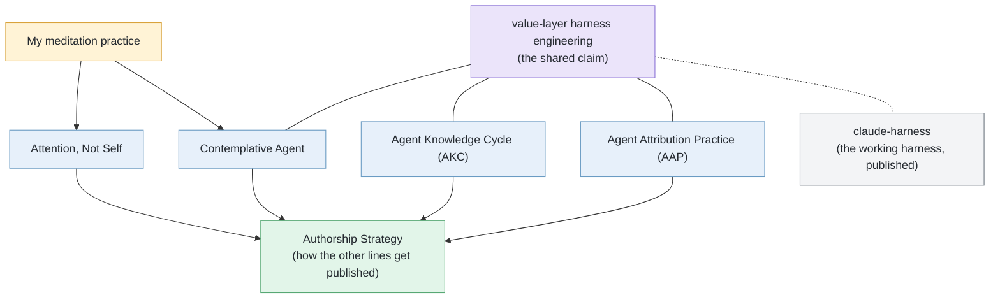

Language: English | [日本語](README.ja.md)

# Tatsuya Shimomoto

> Hub repository for five practice lines (long-running, independently citable projects) by Tatsuya Shimomoto (shimo4228): how I build AI agents, how an author stays findable when readers ask LLMs first, and what I have noticed about the mind through meditation. The three agent-design lines share one claim (see [Through-line](#through-line)).

I'm Tatsuya Shimomoto (shimo4228). I build AI agents solo, with no lab and no affiliation, working out what good practice looks like in the AI age. One of them, Contemplative Agent, runs locally on an M1 Mac using a local LLM, not a cloud API. I also sit in meditation, and one of the five lines is simply what I found there, written down. The DOIs are tools, not a title. They keep the work citable, durable, and traceable.

If you build agent harnesses (the standing rules and tools an agent runs inside), think about accountability for autonomous agents, or care about authorship in the AI age, one of the five lines below is probably for you. Alongside the five lines, the harness I run every day is also public, as [claude-harness](https://github.com/shimo4228/claude-harness).

This repo is a map, not the source of truth for live state. Each practice line has its own repository and permanent DOI, and the hub keeps their stable relationships and citation pointers in one place.

## At a Glance

| Line | Role | Stable concept | Canonical record |
|---|---|---|---|
| [Contemplative Agent](https://github.com/shimo4228/contemplative-agent) | Agent disposition and implementation | A local agent that holds its value layer as an explicit harness artifact (a Constitution it amends from experience; every amendment passes human review). | [DOI 10.5281/zenodo.19212118](https://doi.org/10.5281/zenodo.19212118) |
| [Agent Knowledge Cycle (AKC)](https://github.com/shimo4228/agent-knowledge-cycle) | Agent-design mechanism | A six-phase loop for sustaining agent-operator intent alignment as both behavior and judgment evolve. | [DOI 10.5281/zenodo.19200726](https://doi.org/10.5281/zenodo.19200726) |
| [Agent Attribution Practice (AAP)](https://github.com/shimo4228/agent-attribution-practice) | Accountability practice | Harness-neutral design decision records (ADRs) for what to prohibit, where controls live, and who answers when an agent fails. | [DOI 10.5281/zenodo.19652013](https://doi.org/10.5281/zenodo.19652013) |
| [Authorship Strategy](https://github.com/shimo4228/authorship-strategy) | Authorship in the AI age | When readers meet ideas through LLMs, an idea can spread while its author's name drops off. This line records the strategy that follows: open the work instead of enclosing it, so the spread itself carries the origin. | [DOI 10.5281/zenodo.20263316](https://doi.org/10.5281/zenodo.20263316) |
| [Attention, Not Self](https://github.com/shimo4228/attention-not-self) | Essays from meditation practice | A personal essay collection and knowledge graph: what I notice in meditation, described with the classical Buddhist map of the mind (Abhidharma) and set beside today's computational models of experience (computational phenomenology). | [DOI 10.5281/zenodo.20262112](https://doi.org/10.5281/zenodo.20262112) |

The five lines are siblings, not dependencies: none requires another to be read or used first. Any one can be adopted alone. Open whichever line sits closest to your interest. The DOIs in the table are Zenodo concept DOIs, parent links that always resolve to the latest version.

## Through-line

One claim runs through the three agent-design lines (Contemplative Agent, AKC, AAP): **[value-layer harness engineering](https://shimo4228.github.io/shimo4228/concepts/value-layer-harness-engineering.html)**.

An agent harness normally holds task regulation such as coding conventions. These lines write value norms into the same layer as well: contemplative axioms drawn from meditation practice, and a judgment framework for authorship decisions. The value norms are not written once and frozen. Like every other rule in the harness, they keep being revised through human review.

The three lines meet this claim at different points. Contemplative Agent asks whether an agent can actually run with such a layer. AKC asks how the layer stays aligned with the operator as both keep changing. AAP asks who answers when it fails.

The claim is not only documented — it runs. [**claude-harness**](https://github.com/shimo4228/claude-harness) is the public copy of the working harness behind everything on this page. It holds the skills, agents, and rules my agents operate inside daily, value norms included, and it is revised through the same human-gated cycle the lines describe. To see value-layer harness engineering as a living instance rather than a written claim, start there.

The diagram in one sentence: my own meditation practice sources Contemplative Agent and Attention, Not Self; the three agent-design lines share the value-layer claim, whose running instance is published as claude-harness; and Authorship Strategy is how the other lines, and itself, get published and cited. The arrows mark where ideas flow from, not dependencies.

## Writing and data

Long-form articles: [Zenn](https://zenn.dev/shimo4228) · [Dev.to](https://dev.to/shimo4228) · [Substack](https://substack.com/@shimo4228) (sources in [zenn-content](https://github.com/shimo4228/zenn-content)). GitHub traffic for this repo is published as a [dashboard](https://shimo4228.github.io/shimo4228/traffic/dashboard/) and [raw data](traffic/), both CC0. Source is archived at [Software Heritage](https://archive.softwareheritage.org/browse/origin/?origin_url=https://github.com/shimo4228/shimo4228).

## Machine reading

For machines, start with [`graph.jsonld`](graph.jsonld), then [`llms.txt`](llms.txt), then [`llms-full.txt`](llms-full.txt). The full ecosystem inventory (supporting repositories, datasets, and more) lives in those files and the [concept index](https://shimo4228.github.io/shimo4228/concepts/), not in this README. To ask questions about this repo in chat, use [DeepWiki](https://deepwiki.com/shimo4228/shimo4228).

## Citation and Identity

Author: Tatsuya Shimomoto (shimo4228) · [ORCID 0009-0002-6168-4162](https://orcid.org/0009-0002-6168-4162) · [Hugging Face @Shimo4228](https://huggingface.co/Shimo4228)

This hub is CC0-licensed. Cite individual practice lines by their concept DOI; cite the hub itself only when referring to the aggregate index, knowledge graph, traffic snapshots, or probe dataset (a time series of LLM-response observations). Machine-readable citation metadata is in [`CITATION.cff`](CITATION.cff).
