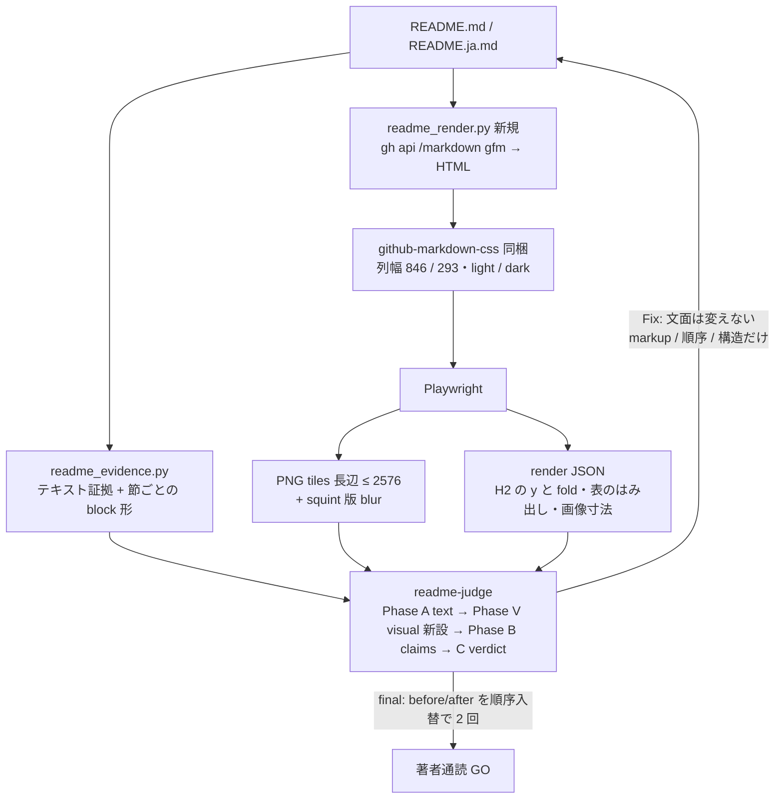

# README の見た目を判定する eval loop と、readme-writer への反映

調査 report: [research/2026-10-06-readme-visual-eval.md](research/2026-10-06-readme-visual-eval.md)（kind: external、4 角度 + local 一次確認）

## Context

- 著者の指摘（2026-10-06）: hub の profile README で「Claude Plugin が先頭の方がいい」「Start here がそのあとの At a glance の表に比べてみにくくて地味」。依頼は「README の見た目について、Eval 項目を徹底リサーチして Eval Loop を回し、それを README 関係のハーネスにも反映」
- 現状の空白: `readme-judge`（`~/.claude/agents/readme-judge.md`、tools は Read / Grep / Glob）は markdown の**テキストだけ**を判定する。描画後の見た目を見る工程は、概要図を PNG にして目で見る（SKILL.md Workflow Step 2）と、著者が GitHub のプレビューを見る（Step 6）の 2 つしかない。`readme_evidence.py` も描画を扱わない
- 実測（report §5、2026-10-06、`github.com/shimo4228` の live DOM）:
  - desktop 1280×800 で README 列は 846 px、上端 y=228。`Start here` の H2 は y=880 で、**最初の画面より下**。カバー画像・H1・lead・紹介段落が第一画面を占める
  - mobile 375×812 で README 列は 293 px、上端 y=901。**README 全体が最初の画面より下**（avatar / bio が先に積まれる）。At a Glance 表は scrollWidth 463 / clientWidth 293 で横スクロールする
  - profile README は pinned repos より上（README 下端 1956、pinned 上端 2005）
  - `POST /markdown` の `markdown` mode は alert を描画しない（blockquote になる）。`gfm` mode + `context` は github.com と同じ `markdown-alert` を出すが、soft line break が ` ` になる → 段落を 1 行で書く README（hub の規約）なら gfm が忠実
  - Playwright は npx キャッシュと `~/Library/Caches/ms-playwright`（chromium 1243）にあるが、readme-writer の依存にはない
- 著者の判断（2026-10-06）: 反映は「描画まで入れる」。カバー画像は縮小・移動・**削除も可**（判定が第一画面の問題を出したとき。採否は最終通読で決める）

## Verdict（report の Found からの選択）

| 必要 | 判断 |
|---|---|
| 描画経路 | **Adopt-part**: GitHub `POST /markdown`（mode=gfm, context=repo）＋ github-markdown-css（MIT、版を pin して同梱）＋ Playwright（Python、uv の依存）。md2static / pageshot は保守状態不明で採らない（report §3） |
| 見た目の判定の形 | **Adopt-part**: 二値チェック（WebDevJudge: binary > Likert）。証拠は座標でなく「見えている文字列・要素名」（AesEval: 位置特定 IoU < 0.20）。テキスト判定を主に残し、画像は描画でしか分からない性質だけに使う（WebDevJudge: code を外す方が screenshot を外すより効く） |
| 前後比較 | **Adopt-part**: final でだけ before / after を順序入れ替えで 2 回聞き、両順序で一致したときだけ「改善」とする（位置バイアス 15.8% vs 0.9%、反転 13.6%） |
| 漂白対策 | **Build**: 見た目の Fix は markup・順序・構造だけを動かし、文面を書き換えない（Voice Under Revision: 書き直しは 1 ラウンド目から register を押す。cap 2 だけでは守れない） |
| 書式の足し算バイアス | **Build**: 「隣の節と重さが違う」は**両方向**で直せる問いにする（軽い方を重くする / 重い方を軽くする / 形の差を役割の差として残す）。LMArena style control: 見出し・太字・リストの量が選好を押し上げる。重さを揃える規範自体は検証済みの原則でなく著者 taste として checklist に明記（report C9） |
| 較正 | **Build**: canary（わざと崩した README）を fixture にして判定器の検出を確かめる（B2 の canary）。外部に README 固有の視覚研究は 0 件 |

## 構造

## 作業 1 — readme-writer に描画と見た目の判定を足す（`~/.claude/`）

書く前に skill: `skill-creator` を読む（skills.md の配線。readme-judge と SKILL.md の大幅改修に当たる）。依存追加は skill: `implementation-chain` の dependency intake を通す。種別 feat、TDD（skill: `tdd`）。

1. **テキスト証拠の拡張** — `scripts/readme_evidence.py`（`collect()` は `:174`）と `scripts/readme_sections.py` に key を足す。verdict・閾値は持たせない（既存方針）
   - `section_forms`: H2 ごとの block 形の個数（list / table / alert / blockquote / paragraph / image / code / details）
   - `list_parallelism`: list ごとに item 冒頭の型（太字リード・リンク始まり・地の文）の揃い
   - `heading_case`: 見出しの大文字化の型（Title / sentence）の混在
   - `alerts`: alert の個数と種別（GitHub Docs の推奨は 1〜2 個 / 文書）
   - `tables`: 列数・行数・1 列表・最長セル
   - `link_text`: 「here / こちら / click」型のリンク文言
   - golden（`tests/golden/`）を更新し、`fixtures/sample_issues.md` に該当パターンを足す
2. **描画証拠の新設** — `scripts/readme_render.py`（新規）
   - 入力: README の path、repo（`owner/name`、`detect_own_repo()` `:155` を再利用）、profile か repo か
   - 処理: `gh api -X POST /markdown -f mode=gfm -f context=<repo>` → `<article class="markdown-body">` に入れ、同梱の `assets/github-markdown.css`（版と取得日を先頭コメントに記録）を当てる → Playwright で幅 846（desktop）/ 293（mobile）× light / dark を撮る。相対画像 path は repo root の file URL に書き換える
   - 出力: PNG を長辺 2576 px 以下の tile に切って出す（Anthropic vision doc の上限）。squint 版は CSS `filter: blur(6px)` を当てて 1 枚ずつ撮る（Pillow は足さない）。render JSON に H2 ごとの y、fold（desktop は README 上端 228 + 画面 800 を既定値にし、引数で上書き可）、表の `scrollWidth > clientWidth`、画像の自然寸法と描画寸法、第一画面に入る block の一覧
   - 依存: `playwright` を `pyproject.toml` の dependencies に足す（`uv lock`）。ブラウザ本体は `playwright install chromium` を前提として SKILL.md の Verification に書く
3. **判定基準 §V の新設** — `references/readme-judge-checklist.md` に節を足し、§E の表に新 key を足す
   - V1 第一画面: 実測の fold の中に identity と「次にどこへ行くか」が見えるか（desktop と mobile を別々に答える。mobile は README 上端からの 1 画面）
   - V2 squint: blur 版で、意図した強調（入口・各 line）が残り、意図しない重い塊が無いか
   - V3 隣接節の形: 形の差が役割の差に対応しているか。No なら「軽い方を重く / 重い方を軽く / 役割を言い分ける」のどれかを Fix に書く（足し算だけを出さない）。**著者 taste の基準**と明記する
   - V4 狭幅: load-bearing な表・画像が mobile で横スクロールや縮小で読めなくなっていないか
   - V5 light / dark: 画像・図・alert が両方で読めるか
   - V6 強調の段数: 強調の水準が 3 段以内、最上位の要素が 2 つ以内か（NN/g visual hierarchy）
   - §D に追記: 見た目の Fix は markup・順序・構造だけで、文面の言い換えを含めない
4. **判定器の手順** — `~/.claude/agents/readme-judge.md`
   - Phase A（text）を凍結した後に **Phase V** を足す: orchestrator が渡す PNG（Read で見る）と render JSON で §V に答える。証拠は見えている文字列か要素名で書く
   - final mode では before / after の desktop PNG を「Image 1 / Image 2」の順と逆順で 2 回比べ、両順序で一致したときだけ「改善」と書く
   - Output Format に `### Visual (§V)` を足す。named verdict の規則は変えない（§V の No が反証で残れば Publishable にしない）
5. **SKILL.md の配線** — Workflow Step 4 / 5 に `readme_render.py` の実行と、PNG・render JSON の受け渡しを足す。「証拠と判定」表の証拠行に描画証拠を足す。Step 2 の「概要図を PNG にして目で確かめる」は描画証拠に吸収できる範囲だけ統合する。Verification に `readme_render.py` のスモークと canary 判定を足す
6. **canary fixture** — `evals/fixtures/` に、見た目を崩した README（入口が fold の下、隣接節の形が役割と無関係に混在、mobile ではみ出す表、alert 3 個）と `.expected.md`。readme-judge が §V の指摘を 3 件中 2 件以上拾い、`fixtures/sample_clean.md` に Rewrite を出さないことを Verification の条件にする
7. **visual.md の整理** — 「表セルの視覚改善は不可能」節に、alert（1〜2 個）・HTML table（`align` / `width` 可、`style` / `class` 不可）など使える lever の表を report §2 から足す。hero 節の「最初の実例: hub repo」は、カバーを外した場合も生成の作法としては有効なので、実例の記述だけ現状に合わせる
8. **ADR** — skill: `adr-writer` で `~/.claude/docs/adr/` に起票する（判定の gate と証拠層の機構変更で、他 artifact が引く）。内容: 描画証拠層の追加、readme-judge の Phase V、見た目の Fix の自由度の制限、Playwright 依存。`adr-reviewer` を通す
9. **公開 copy** — 本 plan の範囲外。必要なら後で skill: `harness-sync`

## 作業 2 — hub README（EN / JA）で eval loop を回す（`~/MyAI_Lab/shimo4228`）

readme-writer の Rewrite ではなく、作業 1 の道具を使った Workflow Step 4〜7 の適用。

1. **ベースライン** — 現行（`eddab91`）の README / README.ja に `readme_evidence.py` と `readme_render.py`（profile、fold 228 + 800）を走らせ、readme-judge（mode: draft）。結果を before として残す
2. **著者の指定を先に入れる**（Step 1 相当、著者が決めた入力。判定の結果ではない）
   - Start here の Claude plugin の行を先頭にする
   - Start here を「早見表」と同じ重さで読める形にする。第一案は「来た場所 | 最初に開く repo | 何か」の表。ただし形は判定 V3 にかける
3. **第一画面** — 判定が V1 で No を出したら、Fix の候補は「カバーの高さを詰める / カバーを Start here の後ろへ下げる / カバーを外す」の 3 つ。どれを採るかは最終通読で著者が決める。外す場合は `assets/readme-cover.jpg` も消す（参照は README 2 本だけと確認済み）
4. **loop** — draft → Fix（markup・順序・構造だけ、EN / JA を同じ構造で）→ recheck。上限 2 ラウンド。final は before / after の順序入れ替え比較を含める
5. **hub の規約の追従** — `CLAUDE.md` / `AGENTS.md` の design rule 4 の「three "From …" lines」を、実際の形（表なら rows）に合わせて書き換える。Start here の掲載条件（外部 directory 掲載 or 流入観測）は変えない
6. **著者通読 GO** — README 全文 + 判定結果 + before / after の PNG（desktop / mobile、light / dark）を渡す。GO の後に commit・push（README は公開物なので GO 前に push しない）。`evals/read-through-log.md` に 1 行足す

## 変えないもの

- 5 本の line の表の中身、concept DOI、llms.txt / llms-full.txt / graph.jsonld（Start here の掲載 repo は変えないので機械 surface の更新は不要）
- readme-judge が唯一のレビュー agent であること、named verdict の型、ループ上限 2
- readme-writer の他モード（Incremental / Review-only / About-only）の手順。Review-only で描画を使うかは orchestrator の任意

## Verification

- `~/.claude`: `uv run pytest tests/ --cov=scripts --cov-report=term-missing`（80% 以上）、`~/.claude/.claude/verify.sh`（ruff / ty / harness lint）、golden 更新の diff を確認
- `readme_render.py` を hub README に走らせ、desktop / mobile × light / dark の PNG と render JSON が出ること。render JSON の `Start here` の y が、live の実測（880 / 1563）と近いこと（列幅と fold の再現の検算）
- canary: readme-judge が §V の指摘を 3 件中 2 件以上拾い、`sample_clean.md` に Rewrite を出さない
- hub: `diff <(grep -c "doi.org/10.5281" README.md) <(grep -c "doi.org/10.5281" README.ja.md)`、`python3 scripts/sync_graph_jsonld_mirror.py` で diff が出ないこと、`python3 -m unittest discover -s tests`
- push 後、in-app browser で `github.com/shimo4228` を 1280×800 と 375×812 で再測定し、Start here の y が fold の中に入ったか（desktop）を記録する
